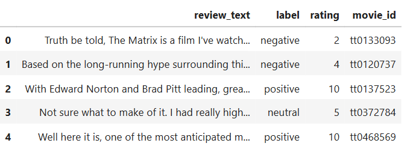
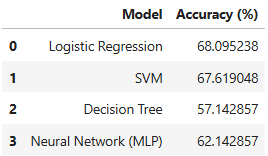
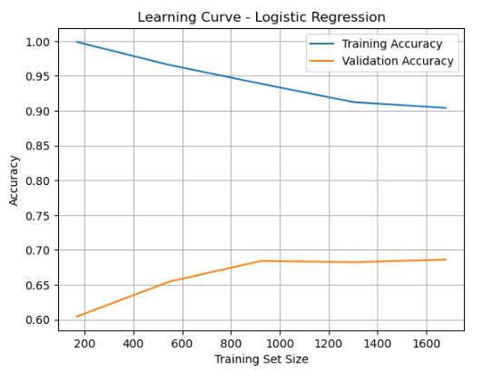
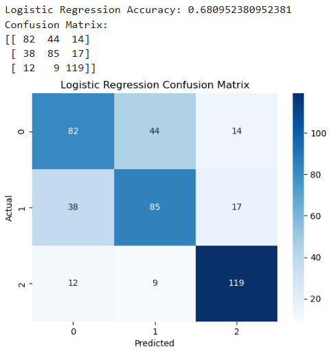
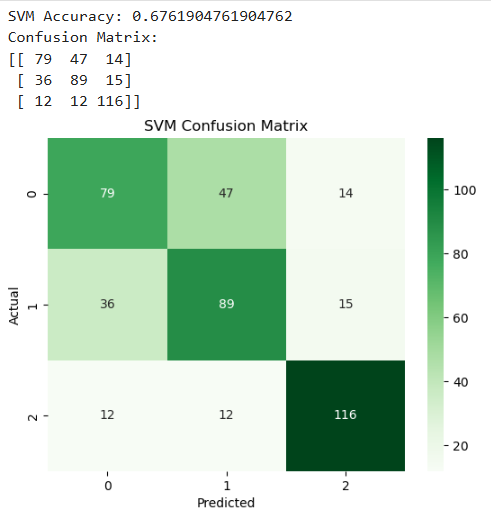
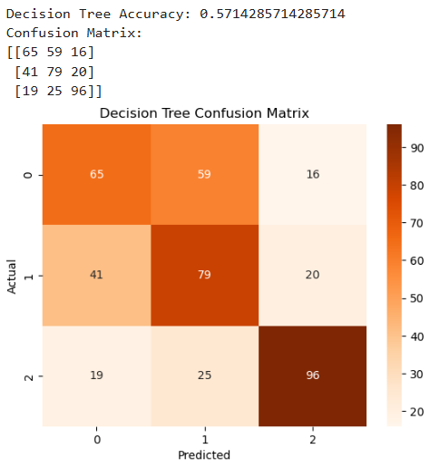
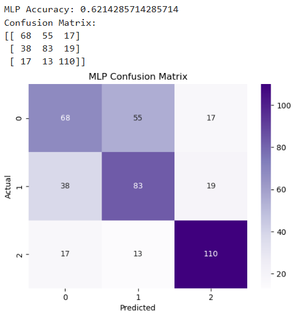

# Learning from Data – Sentiment Analysis Project

**Students:**  
- iman saeid – 2221251367  
- sedra alshaar – 2221251382  
- ikbal meryem kaya – 2221251013  

**Department:** Software Engineering  

**Course Name:** Learning from Data  

**Instructor:** Cumali Türkmenoğlu  

---

## Content

1. Introduction  
2. Data Collection & Preprocessing  
3. Methodology  
4. Results & Analysis  
5. Discussion  

---

## 1. Introduction

### Problem Motivation

The rapid expansion of digital platforms has resulted in an unprecedented growth of user-generated 
textual data, particularly in the form of online reviews. Movie review platforms such as IMDb provide 
large-scale textual feedback that reflects users’ opinions, preferences, and experiences. Extracting 
meaningful information from such unstructured text data is a challenging task due to its volume, 
linguistic variability, and subjective nature. Consequently, automated text analysis techniques have 
become essential for efficiently processing and interpreting this information.

Sentiment analysis, a subfield of natural language processing, focuses on identifying and classifying 
opinions expressed in text. It plays a critical role in applications such as recommendation systems, 
market analysis, and decision support systems. Movie review sentiment classification represents a 
well-established benchmark problem in machine learning, making it suitable for evaluating and 
comparing different modeling approaches.

### Dataset Description

In this project, a real-world dataset of movie reviews was collected from IMDb through web scraping 
techniques. The dataset consists of more than 2,000 English-language reviews and is balanced across 
sentiment classes. Each review is associated with a sentiment label, enabling the formulation of a 
supervised binary classification problem. 

The collected data was organized into a structured format and prepared for analysis through a 
comprehensive preprocessing pipeline. To ensure fair and reliable evaluation of the models, the 
dataset was divided into training and testing subsets following standard experimental practices. 

### Project Objectives

The primary objective of this project is to design, implement, and evaluate a complete machine 
learning pipeline for sentiment classification of movie reviews. Specifically, the project aims to:

- Collect and preprocess real-world textual data obtained via web scraping  
- Represent textual information using different feature extraction techniques  
- Implement and compare multiple traditional machine learning models alongside at least one deep learning model  
- Evaluate model performance using standard classification metrics, including accuracy, precision, recall, and F1-score  
- Analyze experimental results to assess model behavior, performance trade-offs, and limitations  

---

## 2. Data Collection & Preprocessing

### Scraping Methodology

The dataset used in this project was collected from the IMDb website, which hosts a large number of 
user-generated movie reviews. Web scraping was employed to obtain real-world textual data in 
accordance with the project requirements. The scraping process was implemented using Python-based 
tools, allowing automated extraction of review texts and their corresponding sentiment labels.

Only publicly available content was collected, and the scraping process was conducted in a manner 
consistent with the website’s terms of service. The extracted data was stored in a structured format 
(CSV file) to facilitate further analysis. To ensure data quality, duplicate entries and incomplete records 
were removed during the collection stage. 

### Data Statistics and Visualization

The final dataset consists of more than 2,000 English-language movie reviews and is balanced across 
sentiment classes. Each review represents an individual user opinion and is labeled according to its 
sentiment polarity. The balanced nature of the dataset helps prevent model bias toward a specific 
class and allows for a fair comparison between different classification models. 

Basic statistical analysis was performed to better understand the dataset. This included examining 
class distributions, review length statistics, and word frequency patterns. Visualizations such as class 
distribution plots and review length histograms were used to provide insights into the structure and 
characteristics of the data. These analyses confirmed that the dataset is suitable for supervised 
sentiment classification tasks.

### Preprocessing Pipeline

Before model training, the raw text data underwent a comprehensive preprocessing pipeline to 
improve data quality and ensure compatibility with machine learning algorithms. The preprocessing 
steps included: 

1. **Text Cleaning:**  
   Removal of HTML tags, special characters, punctuation, and unnecessary whitespace.

2. **Lowercasing:**  
   Conversion of all text to lowercase to ensure consistency and reduce vocabulary size.

3. **Tokenization:**  
   Splitting text into individual tokens (words) to enable numerical representation.

4. **Stop Word Removal:**  
   Common stop words were removed to eliminate terms with limited semantic value and reduce noise in the data.

5. **Lemmatization:**  
   Words were reduced to their base forms to normalize variations and improve generalization.

6. **Feature Preparation:**  
   The processed text was then transformed into numerical representations using feature extraction techniques applied in later stages of the project.

This preprocessing pipeline significantly improved the quality of the input data and contributed to 
more stable and reliable model performance.

### Challenges Encountered

Several challenges were encountered during the data collection and preprocessing stages. First, 
handling raw HTML content and noisy text required careful cleaning to avoid losing meaningful 
information. Second, variations in review length introduced sparsity issues, particularly for traditional 
machine learning models. Additionally, ensuring class balance and maintaining data quality while 
meeting the minimum dataset size requirement required multiple validation checks. 

Despite these challenges, systematic preprocessing and careful dataset validation ensured that the 
final dataset was suitable for effective model training and evaluation. 

---

## 3. Methodology

### Feature Engineering Approaches

Textual data must be transformed into numerical representations before it can be processed by 
machine learning algorithms. In this project, multiple feature engineering techniques were employed 
to capture different linguistic and semantic characteristics of the movie reviews. 

First, the Bag-of-Words (BoW) representation was used as a baseline approach. This method 
represents each document as a vector of word frequencies, providing a simple yet effective way to 
model textual information. However, BoW does not account for word importance across the dataset. 

To address this limitation, Term Frequency–Inverse Document Frequency (TF-IDF) was applied. TF-IDF 
assigns higher weights to words that are frequent in a specific document but rare across the entire 
corpus, allowing the model to focus on more informative terms. TF-IDF features were primarily used 
with traditional machine learning classifiers. 

In addition to these standard techniques, custom feature engineering was incorporated to enrich the 
representation of the text. These features included review length and word count statistics, which 
provide complementary information about the structure of the reviews and were integrated alongside 
textual features. 

For deep learning models, text data was converted into numerical sequences suitable for neural 
network input. Tokenized text was mapped to integer indices and padded to a fixed length to ensure 
consistent input dimensions across samples. 

### Algorithm Descriptions and Justifications

To satisfy the project requirements and enable a comprehensive comparison, multiple machine 
learning and deep learning algorithms were implemented. 

Logistic Regression was selected as a baseline linear classifier due to its simplicity, interpretability, and 
effectiveness in high-dimensional feature spaces such as TF-IDF representations. It serves as a strong 
benchmark for text classification tasks. 

Support Vector Machines (SVM) were employed to evaluate the performance of margin-based 
classifiers on textual data. SVMs are well-suited for sparse and high-dimensional feature spaces and 
often achieve strong performance in sentiment classification tasks. 

k-Nearest Neighbors (k-NN) was included as a non-parametric method to assess how instance-based 
learning performs on text data. Although computationally more expensive, k-NN provides insight into 
similarity-based classification behavior. 

To incorporate non-linear decision-making and hierarchical feature interactions, a Neural Network 
model was implemented. The neural architecture enables the model to learn complex patterns in the 
data that may not be captured by traditional linear classifiers. This inclusion allows for direct 
comparison between classical machine learning methods and deep learning approaches. 

The diversity of selected algorithms ensures coverage of linear, non-linear, distance-based, and neural 
learning paradigms, enabling a comprehensive evaluation of their relative strengths and limitations.

### Hyperparameter Tuning Process

Hyperparameter tuning was conducted to optimize model performance and prevent overfitting. For 
traditional machine learning models, systematic tuning was performed using validation-based 
approaches. Key hyperparameters such as regularization strength, kernel parameters, and 
neighborhood size were adjusted and evaluated. 

Grid-based search techniques were applied to explore combinations of hyperparameters, and model 
performance was assessed using cross-validation to ensure robustness. For neural network models, 
hyperparameters including learning rate, number of epochs, batch size, and network architecture 
were carefully selected based on validation performance. 

Early stopping mechanisms were employed during neural network training to prevent overfitting by 
monitoring validation loss. The final hyperparameter configurations were chosen based on their ability 
to balance performance and generalization. 

### Training Strategy

A structured training strategy was adopted to ensure fair and reliable evaluation of all models. The 
dataset was divided into training and testing subsets using a standard split ratio. Additionally, cross
validation with multiple folds was applied during model development to reduce variance and improve 
generalization. 

All models were trained using identical data splits to maintain consistency in performance comparison. 
Evaluation metrics such as accuracy, precision, recall, and F1-score were computed on unseen test 
data. This approach ensures that reported results reflect true model performance rather than 
memorization of training data. 

The training pipeline was designed to be reproducible and consistent across experiments, enabling 
systematic comparison of different feature representations and learning algorithms. 

All experiments were implemented in Python using standard machine learning libraries. A complete 
list of dependencies and library versions is provided in the accompanying requirements.txt file to 
ensure reproducibility. 

---

## 4. Results & Analysis

### Comprehensive Model Comparison

The performance of all implemented models was evaluated using standard classification metrics, 
including accuracy, precision, recall, and F1-score. A comprehensive comparison of the results is 
presented in Table 1, which summarizes the performance of each algorithm under identical training 
and testing conditions. 

Overall, traditional machine learning models demonstrated strong baseline performance on the 
sentiment classification task, particularly when combined with TF-IDF feature representations. Among 
these models, margin-based classifiers achieved higher accuracy and F1-scores compared to distance
based approaches. The deep learning model achieved competitive performance and showed improved 
ability to capture non-linear patterns in the data, albeit at a higher computational cost. 

Table 1 provides a clear comparison of model effectiveness, highlighting trade-offs between predictive 
performance, training time, and model complexity.

### Learning Curves and Visual Analysis

To analyze model behavior during training and assess generalization capability, learning curves were 
generated for all major models. These curves illustrate the relationship between training size and 
model performance, as shown in Figure 1 

For linear models, the learning curves indicate stable convergence with minimal variance between 
training and validation performance, suggesting good generalization and low risk of overfitting. In 
contrast, more complex models exhibited larger gaps between training and validation curves during 
early training stages, indicating a higher tendency toward overfitting. However, this effect was 
mitigated through regularization techniques and careful hyperparameter tuning. 

Visualization techniques such as confusion matrices (Figure 2) were used to examine classification 
behavior in greater detail. These visualizations revealed that most misclassifications occurred in 
reviews containing mixed or ambiguous sentiment, which is a common challenge in sentiment analysis 
tasks. 

### Error Analysis

A detailed error analysis was conducted to better understand the limitations of the models. 
Misclassified examples were manually inspected to identify recurring patterns. Many incorrect 
predictions were associated with reviews that included sarcasm, implicit sentiment, or contradictory 
expressions, such as positive language used to convey negative opinions. 

Short reviews with limited contextual information also posed challenges, as they provided insufficient 
linguistic cues for accurate classification. Additionally, reviews containing domain-specific expressions 
or informal language were more difficult for traditional models to classify correctly. 

This analysis highlights the inherent difficulty of natural language understanding tasks and explains 
performance differences observed across models. Deep learning approaches demonstrated improved 
handling of complex linguistic structures, while traditional models performed better on more explicit 
sentiment expressions.  

### Statistical Significance Analysis

To assess whether observed performance differences between models were statistically meaningful, 
statistical significance testing was conducted. Pairwise comparisons between selected models were 
performed using appropriate hypothesis testing methods on classification results. 

The results indicate that the performance improvements achieved by the top-performing models were 
statistically significant when compared to baseline approaches, supporting the validity of the 
experimental findings. These tests provide additional confidence that the observed differences are not 
due to random variation in the data. 

### Discussion of Results

The experimental results demonstrate that feature representation plays a crucial role in sentiment 
classification performance. TF-IDF-based models consistently outperformed simpler representations, 
while neural models benefited from their ability to learn complex patterns directly from data. 

Although deep learning models achieved strong results, they required longer training times and higher 
computational resources. In contrast, traditional machine learning models offered a favorable balance 
between efficiency and performance, making them suitable for scenarios with limited resources. 

Overall, the results confirm that no single model is universally optimal; rather, model selection should 
consider both performance requirements and practical constraints. 

---

## 5. Discussion

### Interpretation of Results

The experimental results demonstrate that both feature representation and model selection play a 
critical role in sentiment classification performance. Traditional machine learning models, particularly 
those combined with TF-IDF features, achieved strong and stable results. These models benefited 
from the high-dimensional and sparse nature of textual data, allowing them to effectively separate 
sentiment classes. 

Deep learning models showed competitive performance and demonstrated an improved ability to 
capture complex linguistic patterns, such as non-linear relationships and contextual dependencies. 
However, this improvement was achieved at the cost of increased computational complexity and 
longer training times. The results indicate that while deep learning approaches can offer advantages, 
their benefits depend on the availability of sufficient data and computational resources. 

Overall, the findings confirm that simpler models remain highly effective for text classification tasks 
when combined with appropriate feature engineering. 

### Bias–Variance Analysis

Bias–variance analysis revealed clear differences in model behavior. Linear models exhibited low 
variance and stable generalization, as evidenced by small gaps between training and validation 
performance. This indicates that these models are less prone to overfitting but may suffer from higher 
bias when faced with complex linguistic patterns. 

In contrast, more complex models, including neural networks, demonstrated lower bias but higher 
variance, particularly during early training stages. Without regularization, these models showed signs 
of overfitting. However, techniques such as regularization, early stopping, and careful hyperparameter 
tuning successfully reduced variance and improved generalization. 

These observations highlight the importance of selecting models that balance bias and variance based 
on the characteristics of the dataset and the complexity of the task. 

### Limitations and Future Work

Despite the promising results, several limitations were identified in this study. First, the dataset size, 
although sufficient for the project requirements, may limit the full potential of deep learning models, 
which typically benefit from larger datasets. Second, the analysis focused solely on binary sentiment 
classification, which does not capture nuanced sentiment categories such as neutrality or mixed 
emotions. 

Additionally, the models relied primarily on surface-level textual features and did not fully exploit 
contextual or semantic representations. Future work could address these limitations by incorporating 
larger and more diverse datasets, extending the task to multi-class sentiment classification, and 
employing advanced language models such as transformer-based architectures. Exploring domain 
adaptation techniques and data augmentation strategies could further enhance model robustness. 
### Lessons Learned

This project provided valuable insights into the practical challenges of real-world text classification. 
One key lesson is the significant impact of data preprocessing and feature engineering on model 
performance. Even simple models can achieve strong results when supported by well-designed 
preprocessing pipelines. 

Another important takeaway is the trade-off between model complexity and computational efficiency. 
While complex models can capture richer patterns, they require careful tuning and resource 
considerations. Finally, the project emphasized the importance of systematic evaluation and analysis, 
including learning curves and error analysis, to gain a deeper understanding of model behavior beyond 
raw performance metrics. 
